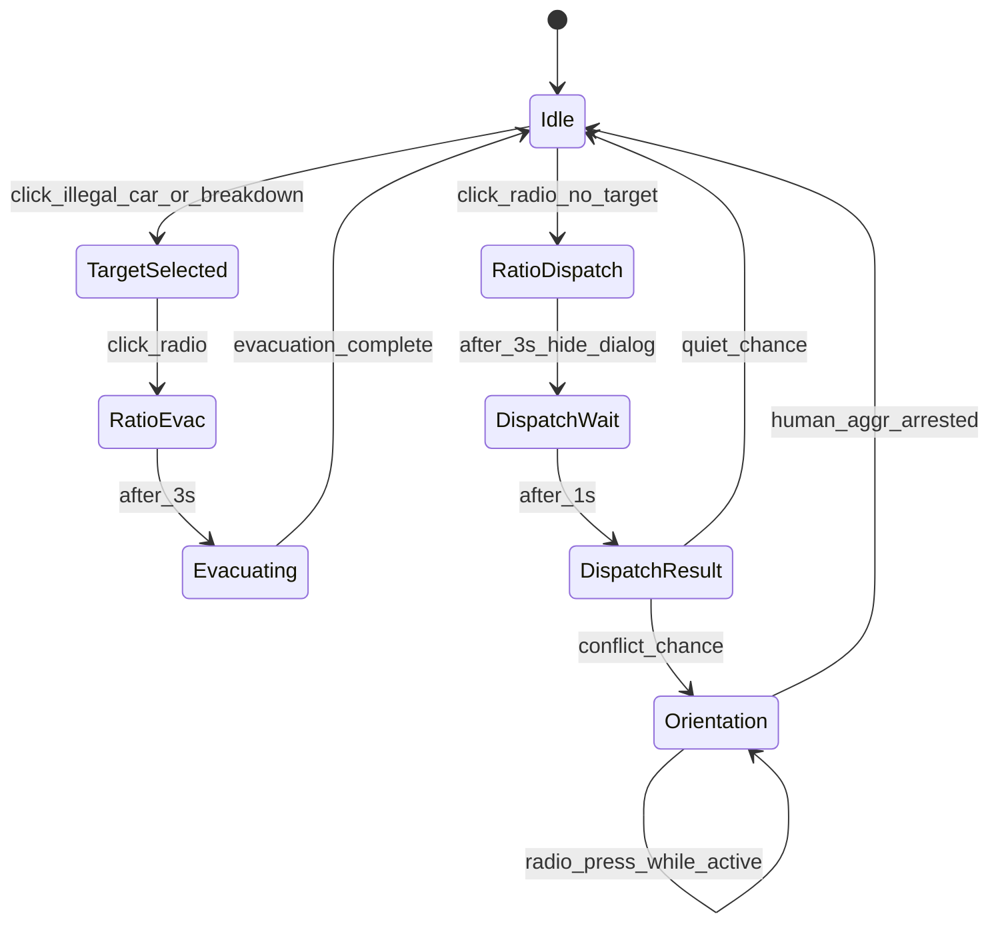
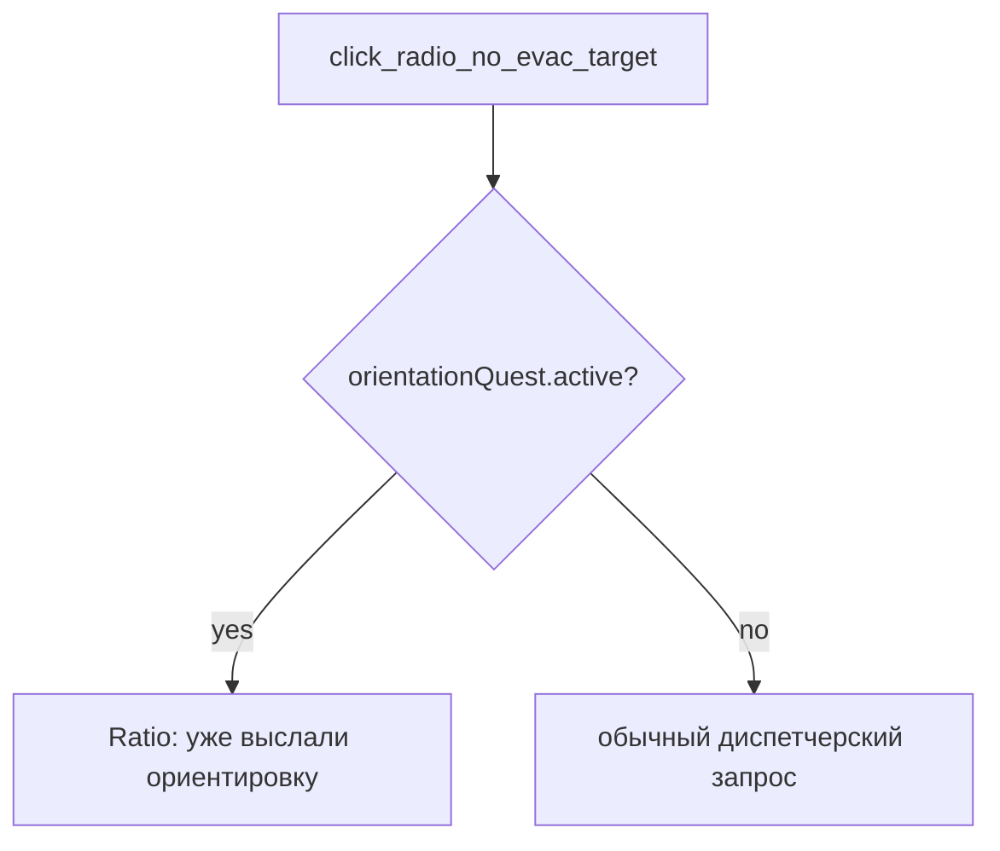

# Система рации и квестов — спецификация реализации

## Контекст (текущий код)

| Что есть                            | Где                                                                                                                                             | Проблема                                                             |
| ----------------------------------- | ----------------------------------------------------------------------------------------------------------------------------------------------- | -------------------------------------------------------------------- |
| Иконка рации без `onClick`          | [`Controllers.jsx`](src/components/controllers/Controllers.jsx):187                                                                             | Нет обработчика                                                      |
| Клик по нарушению → сразу эвакуатор | [`ParkingZoneLayer.jsx`](src/components/game/ParkingZoneLayer.jsx):93–97, [`mapStore.handleParkingViolationClick`](src/state/mapStore.jsx):1054 | Нет двухшагового флоу                                                |
| Ratio при `spawn_delay`             | [`Game.jsx`](src/components/game/Game.jsx):231–233                                                                                              | Показывается автоматически, не по рации                              |
| `isParkingFineActive()`             | [`mapStore.jsx`](src/state/mapStore.jsx):477–484                                                                                                | Блокирует управление уже при `pendingSpotIndex`, мешает нажать рацию |
| C2 roadside                         | только в [`GAME_DESIGN_DRAFT.md`](.cursor/planner/GAME_DESIGN_DRAFT.md)                                                                         | Не реализован                                                        |
| human_aggr квест                    | [`objects.jsx`](src/state/objects.jsx):75–78 → `startQuest`                                                                                     | Работает по клику; диспетчерский спавн — новый                       |

**Единицы:** 80–250 игровых метров = **1600–5000 world px** (`distanceMetersFactor = 20`, [`state_app.jsx`](src/state/state_app.jsx)).

---

## Уточнение по п.4 (режимы)

Исходный п.4 («только свободный режим») **уточнён пользователем:** рация видна и работает в **`free` + `timed`**, скрыта в **`chase`**.

---

## Общая модель: двухшаговый флоу



### Константы

**Тексты и тайминги** — [`src/state/ratioConstants.js`](src/state/ratioConstants.js) (новый):

```js
export const RATIO_DISPLAY_SEC = 3; // уже есть в parkingZoneConstants
export const DISPATCH_RESPONSE_DELAY_SEC = 1;

export const DISPATCH_REQUEST_MESSAGES =  ['Диспетчер, я свободный, есть что по близости?', 'Диспетчер, диспетчер, есть работа?', 'Диспетчер, есть что рядом?', 'Диспетчер, готов принять вызов', 'Диспетчер, есть что интересного?'];

export const EVACUATION_RATIO_MESSAGE = "Диспетчер, нужен эвакуатор.";
export const DISPATCH_CONFLICT_MESSAGE = "Да, рядом замечен конфликт";
export const DISPATCH_QUIET_MESSAGE =
  "Пока всё тихо, продолжайте потрулирование";
export const DISPATCH_ORIENTATION_ALREADY_MESSAGE =
  "Мы уже выслали ориентировку, следую к цели";

export const ORIENTATION_MIN_METERS = 80; // 1600 world px
export const ORIENTATION_MAX_METERS = 250; // 5000 world px
```

**Шанс квеста ориентировки** — [`src/state/event.config.js`](src/state/event.config.js) (рядом с `PEDESTRIAN_QUEST_SPAWN_CHANCE`):

```js
/** Диспетчерский запрос: шанс ориентировки на human_aggr после паузы 1 с */
export const DISPATCH_ORIENTATION_CONFLICT_CHANCE = 0.2;
```

Импорт в `ratioStore` / `mapStore`: `Math.random() < DISPATCH_ORIENTATION_CONFLICT_CHANCE` — **не** хардкод в ratioConstants.

---

## П.1 — Неправильная парковка

### Поведение

1. **Клик по illegal-машине** → `spot.fining = true`, `pendingSpotIndex = spotIndex`, машина моргает (класс `parking-violation-car--fining` — уже есть).
2. **НЕ** вызывать `playRatioSound()`, **НЕ** стартовать `parkingEvacuation`.
3. **Клик по рации** (при выбранной цели) → `playRatioSound()` → показать `Ratio` с `EVACUATION_RATIO_MESSAGE` → через 3 с скрыть Ratio → старт `parkingEvacuation.phase = 'spawn_delay'` (эвакуатор через 3 с после сообщения).
4. Машина продолжает моргать между шагами 1 и 3.

### Изменения в коде

| Файл                                                               | Действие                                                                                                                                                                  |
| ------------------------------------------------------------------ | ------------------------------------------------------------------------------------------------------------------------------------------------------------------------- |
| [`mapStore.jsx`](src/state/mapStore.jsx)                           | Разделить `handleParkingViolationClick` на `selectParkingViolationTarget()` (только fining) и `confirmParkingEvacuationViaRadio()` (ratio + evacuation)                   |
| [`mapStore.jsx`](src/state/mapStore.jsx)                           | Рефактор `isParkingFineActive()` → `isEvacuationInProgress()` (phase !== idle) для блокировки управления; отдельный `hasPendingEvacuationTarget()` для UI-подсветки рации |
| [`ParkingZoneLayer.jsx`](src/components/game/ParkingZoneLayer.jsx) | Убрать `playRatioSound()` и прямой вызов evacuation; только `selectParkingViolationTarget`                                                                                |
| [`Game.jsx`](src/components/game/Game.jsx)                         | Убрать `{spawn_delay && <Ratio ...>}` — Ratio управляется централизованно                                                                                                 |
| [`Controllers.jsx`](src/components/controllers/Controllers.jsx)    | `onClick` на рацию → `mapStore.handleRatioPress()`; показывать только при `gameMode !== 'chase'`                                                                          |

### Таблица влияния (парковка)

| Вопрос                                                         | До                             | После                               |
| -------------------------------------------------------------- | ------------------------------ | ----------------------------------- |
| Клик по illegal                                                | Ratio sound + evacuation сразу | Только моргание                     |
| Ratio диалог                                                   | Авто при spawn_delay           | Только после рации                  |
| controlsBlocked                                                | При pendingSpotIndex           | Только при phase !== idle           |
| E2E [`parking-quest.spec.js`](tests/e2e/parking-quest.spec.js) | click car → evacuator          | click car → click radio → evacuator |

---

## П.2 — C2 «Заглохла у обочине» (PLAN волна 5)

Зависит от реализации объекта `roadside_breakdown` (ещё нет в [`objects.jsx`](src/state/objects.jsx)).

### Поведение (аналогично п.1)

1. Клик по сломанной машине у обочины → моргание (новый CSS-класс `roadside-breakdown-car--selected`, аварийка + пар из PLAN).
2. Клик по рации → `Ratio`: «Диспетчер, нужен эвакуатор.» → 3 с → эвакуатор → погрузка → `addHelp('roadsideHelp')` (+2 очка, [`PLAN.md`](.cursor/planner/PLAN.md)).

### Архитектура

- Общий тип цели эвакуации в `mapStore`: `pendingEvacuationTarget = { kind: 'parking' | 'roadside', ... }`.
- Переиспользовать `parkingEvacuation` (или переименовать в `evacuation`) с полем `sourceKind`.
- Новый слой [`RoadsideBreakdownLayer.jsx`](src/components/game/RoadsideBreakdownLayer.jsx) по образцу `ParkingZoneLayer`.
- Спавн: `roadside_breakdown` в `objects.jsx`, интервал 175–400 м (3500–8000 world px), режимы free+timed, взаимоисключение с активной эвакуацией.

---

## П.3 — Диспетчерский запрос (без выбранной цели)

### Приоритет: активная ориентировка (дополнение)

Если `orientationQuest.active === true` и игрок снова нажимает рацию (нет `pendingEvacuationTarget`):

- **Не** бросать шанс — проверять только флаг активного квеста.
- Показать `Ratio`: **`DISPATCH_ORIENTATION_ALREADY_MESSAGE`** — «Мы уже выслали ориентировку, следую к цели» (3 с).
- Повторный спавн `human_aggr` **запрещён** — только один активный квест ориентировки.



### Таймлайн (ориентировка не активна)

| t    | Событие                                                                                              |
| ---- | ---------------------------------------------------------------------------------------------------- |
| 0    | Клик рации, нет `pendingEvacuationTarget` → случайная фраза из `DISPATCH_REQUEST_MESSAGES` → `Ratio` |
| 3 с  | Ratio скрывается                                                                                     |
| +1 с | Ветвление по `DISPATCH_ORIENTATION_CONFLICT_CHANCE` из [`event.config.js`](src/state/event.config.js) |

### 3.1 — conflict chance «конфликт»

1. Снова `Ratio`: «Да, рядом замечен конфликт» (3 с).
2. Гарантированный спавн `human_aggr1|2|3` на `offsetX + random(1600..5000)` world px.
3. `orientationQuest.active = true`.
4. HUD по центру сверху: **«{N} м»** (`max(0, round((target.worldX - offsetX) / 20))`).
5. При проезде мимо — метраж clamp 0, HUD до ареста.
6. Клик по `human_aggr` → [`PoliceQuestModal`](src/components/game/PoliceQuestModal.jsx) → арест → `orientationQuest.active = false`.

### 3.2 — quiet chance «тихо»

- `Ratio`: «Пока всё тихо, продолжайте потрулирование» (3 с) → idle.

### Ограничения

- Новый roll **не** запускать при: полиция/пешеход/арест/эвакуация/pending target.
- При **активной ориентировке** — только «уже выслали», без roll.
- Во время серии Ratio-блоков рация disabled (debounce).

### Новые сущности

```js
// mapStore
orientationQuest = {
  active: false,
  targetUid: null,
  targetWorldX: 0,
};
```

- Компонент [`OrientationDistanceHud.jsx`](src/components/game/OrientationDistanceHud.jsx) — `observer`, читает `mapStore.orientationQuest` + `offsetX`.
- Метод `mapStore.spawnOrientationTarget()` — создаёт объект в `activeObjects`, помечает `orientationSpawn: true`.
- `finishOrientationQuest()` — при `finishQuest()` / аресте orientation-цели.

---

## П.4 — Видимость рации

```jsx
// Controllers.jsx — рендер иконки
{(gameMode === 'free' || gameMode === 'timed') && (
  
)}
```

Проп `gameMode` передать из [`Game.jsx`](src/components/game/Game.jsx).

Визуальная подсказка: класс `ratio-img-controller--has-target` когда `hasPendingEvacuationTarget()`.

---

## П.6 — Туториал: парковка и сломанная машина (дополнение)

Расширить [`tutorialStore.js`](src/state/tutorialStore.js) и [`TutorialOverlay.jsx`](src/components/game/TutorialOverlay.jsx). Только **free** mode (как остальной туториал).

### Новые шаги и флаги

| Шаг | `currentStep` | Селектор указателя | Завершение |
| --- | --- | --- | --- |
| E1 | `parking-violation` | `[data-type="parking-violation-car"]` (ближайшая illegal на экране) | клик по машине |
| E2 | `ratio-after-parking` | `[data-type="ratio"]` на Controllers | клик по рации |
| F1 | `roadside-breakdown` | `[data-type="roadside-breakdown-car"]` | клик по машине |
| F2 | `ratio-after-breakdown` | `[data-type="ratio"]` | клик по рации |

Новые флаги: `parkingBlockDone`, `roadsideBlockDone`. В `isTutorialComplete` добавить оба.

`data-type="ratio"` — добавить на `` рации в [`Controllers.jsx`](src/components/controllers/Controllers.jsx).

### 3.1 — Неправильная парковка (первый раз)

1. `trackParkingFine()` — при первом illegal `parking-violation-car` на экране (после Block A, вне Block B).
2. `carStore.releaseGas()` — как у бандита; **педаль газа не блокируется** (`shouldSuppressDrivingBlocks` не трогаем).
3. Указатель на illegal-машину (`parking-violation`).
4. Игрок нажал машину → `selectParkingViolationTarget` + `currentStep = 'ratio-after-parking'`.
5. Указатель на рацию → клик → `parkingBlockDone = true`, `currentStep = null`.

### 3.2 — Сломанная машина (первый раз)

Аналогично Block E, но объект `roadside_breakdown`, шаги `roadside-breakdown` → `ratio-after-breakdown`. Зависит от C2; `trackRoadsideBreakdown()` вызывается после `parkingBlockDone` или параллельно по приоритету (парковка первее, если оба на экране — зафиксировать: **парковка > roadside**).

### WORLD_STEPS в TutorialOverlay

Добавить `parking-violation`, `roadside-breakdown` в `WORLD_STEPS` (rAF-позиционирование, как `roadside-bandit`).

### Hooks из Game / слоёв

- `ParkingZoneLayer` onClick illegal → `tutorialStore.onParkingViolationClicked()` если step === `parking-violation`.
- `RoadsideBreakdownLayer` onClick → `tutorialStore.onRoadsideBreakdownClicked()`.
- `Controllers` onClick ratio → `tutorialStore.onRatioClicked()` — завершает E2/F2.

---

## П.7 — Туториал: таймаут сирены Block B (дополнение)

**Проблема:** при появлении enemy quest-car указатель на сирене «долбится» бесконечно, если игрок не нажал сирену и 4-ю передачу.

**Решение:** таймаут **только на шаг `siren`** (Block B), без перехода на `gear-4`.

| Параметр | Значение |
| --- | --- |
| Константа | `TUTORIAL_SIREN_TIMEOUT_SEC = 4` в [`event.config.js`](src/state/event.config.js) (рядом с quest chances) |
| Старт отсчёта | `currentStep === 'siren'` (при входе в шаг сброс `sirenStepSeconds = 0`) |
| По истечении 4 с без `carStore.sirena` | `enemyBlockDone = true`, `currentStep = null`, указатель скрыт |
| Шаг `gear-4` | **Не показывается** (ветка Block B прервана) |
| Если сирена нажата раньше | Текущее поведение: `siren` → `gear-4` → `enemyBlockDone` |

Изменения в [`tutorialStore.js`](src/state/tutorialStore.js):

- Поле `sirenStepSeconds = 0`.
- В `tick()`: если `currentStep === 'siren'` && !sirena → накопление; при `>= TUTORIAL_SIREN_TIMEOUT_SEC` → `skipSirenBlockB()` (runInAction: enemyBlockDone=true, currentStep=null).
- При переходе на `siren` — сброс `sirenStepSeconds`.
- При `sirena === true` — сброс таймера, переход на `gear-4` (без изменений).

Тесты [`tutorialStore.test.js`](src/state/tutorialStore.test.js):

- siren 4 с без нажатия → `enemyBlockDone`, step null, не `gear-4`.
- siren нажата за 2 с → по-прежнему `gear-4`.

---

## П.5 — Утечки памяти

### Риски и меры

| Риск                                           | Мера                                                                                          |
| ---------------------------------------------- | --------------------------------------------------------------------------------------------- |
| Цепочка `setTimeout` диспетчера (3с + 1с + 3с) | `ratioSessionId` — инкремент при каждом нажатии; колбэки проверяют актуальный id              |
| Ratio unmount                                  | Уже есть `clearTimeout` в [`Ratio.jsx`](src/components/car/Ratio.jsx):27–29                   |
| `playRatioSound` singleton Audio               | OK — один экземпляр [`ratioAudio.js`](src/components/car/ratioAudio.js)                       |
| CSS `animation: infinite` на моргающих машинах | Снимать класс `fining` при despawn/finalize; не оставлять `pendingSpotIndex` после ухода зоны |
| mapStore.dispose                               | Добавить `clearRatioTimers()`, сброс `orientationQuest`, `pendingEvacuationTarget`            |
| Game unmount                                   | `useEffect` cleanup для ratio state                                                           |
| MobX reactions                                 | Не добавлять per-frame reactions; HUD через `observer` + существующий game loop               |

### Паттерн ratio-сессии (рекомендуется `ratioStore.jsx`)

```js
ratioSession = {
  phase: "idle" | "showing" | "dispatch_wait" | "dispatch_result",
  message: null,
  sessionId: 0,
  timers: [], // ids для dispose
};
```

`dispose()` → `timers.forEach(clearTimeout)`.

---

## Централизация Ratio в Game.jsx

Заменить разрозненные `<Ratio>` на один блок:

```jsx
{
  ratioStore.message && (
    <Ratio
      key={ratioStore.sessionId}
      message={ratioStore.message}
      onDismiss={() => ratioStore.onRatioDismiss()}
      playSound={ratioStore.playSoundOnShow}
    />
  );
}
{
  mapStore.orientationQuest.active && (
    <OrientationDistanceHud mapStore={mapStore} />
  );
}
```

`key={sessionId}` гарантирует remount и сброс таймера при смене сообщения.

---

## Обновление PLAN.md

Добавить секцию **«Рация — двухшаговое взаимодействие»**: фразы (п.0), тайминги, `DISPATCH_ORIENTATION_CONFLICT_CHANCE` в event.config, сообщение «уже выслали ориентировку», туториал парковки/roadside, таймаут сирены 4 с. C2: тап по машине → рация.

---

## Рация — двухшаговое взаимодействие

### Общая модель

1. **Выбор цели** — клик по `parking-violation-car` или `roadside-breakdown-car` → моргание, `pendingEvacuationTarget`.
2. **Подтверждение рацией** — клик `[data-type="ratio"]` в Controllers → `EVACUATION_RATIO_MESSAGE` («Диспетчер, нужен эвакуатор.») → 3 с → `parkingEvacuation.phase = 'spawn_delay'` → эвакуатор.
3. **Без цели** — клик рации → случайная фраза из `DISPATCH_REQUEST_MESSAGES` → 3 с → пауза 1 с → ветвление.

### Константы и тайминги

| Параметр | Значение | Файл |
| --- | --- | --- |
| `RATIO_DISPLAY_SEC` | 3 с | `ratioConstants.js` |
| `DISPATCH_RESPONSE_DELAY_SEC` | 1 с | `ratioConstants.js` |
| `DISPATCH_ORIENTATION_CONFLICT_CHANCE` | 0.2 (20%) | `event.config.js` |
| `TUTORIAL_SIREN_TIMEOUT_SEC` | 4 с | `event.config.js` |
| Интервал `roadside_breakdown` | 175–400 игровых м (3500–8000 world px) | `roadsideBreakdownConstants.js` |

### Фразы рации

| Ситуация | Текст |
| --- | --- |
| Запрос диспетчеру | Случайная из `DISPATCH_REQUEST_MESSAGES` |
| Эвакуация (парковка / C2) | «Диспетчер, нужен эвакуатор.» |
| Конфликт (ориентировка) | «Да, рядом замечен конфликт» |
| Тихо | «Пока всё тихо, продолжайте потрулирование» |
| Повтор при активной ориентировке | «Мы уже выслали ориентировку, следую к цели» |

### C2 «Заглохла у обочине»

- Объект `roadside_breakdown` в `objects.jsx`, слой `RoadsideBreakdownLayer.jsx`.
- Двухшаговый флоу: **тап по машине** (`data-type="roadside-breakdown-car"`) → **рация** → эвакуатор → `addHelp('roadsideHelp')` (+2 очка free/timed).
- Взаимоисключение с активной эвакуацией; недоступно в `chase`.

### Туториал (только `free`)

| Шаг | Селектор | Завершение |
| --- | --- | --- |
| `parking-violation` | `[data-type="parking-violation-car"]` | клик по машине |
| `ratio-after-parking` | `[data-type="ratio"]` | клик по рации |
| `roadside-breakdown` | `[data-type="roadside-breakdown-car"]` | клик по машине |
| `ratio-after-breakdown` | `[data-type="ratio"]` | клик по рации |

Приоритет на экране: **парковка > roadside**. Block B: на шаге `siren` без нажатия за 4 с → `enemyBlockDone`, без перехода на `gear-4`.

### Режимы

Рация видна и работает в **`free` + `timed`**, скрыта в **`chase`**.

---

## Тесты

| Тест                              | Что проверяет                                                              |
| --------------------------------- | -------------------------------------------------------------------------- |
| `mapStore.test.jsx`               | select → radio confirm → evacuation; dispatch conflict/quiet (mock `DISPATCH_ORIENTATION_CONFLICT_CHANCE`) |
| `ratioStore.test.js`              | timer chain, sessionId invalidation, dispose; orientation active → already message, no roll |
| `tutorialStore.test.js`           | parking/breakdown steps; siren 4 s timeout; ratio step completion |
| `parking-quest.spec.js`           | two-step: car click + radio click                                          |
| Новый `orientation-quest.spec.js` | dispatch → HUD → repeat radio → already message → arrest → HUD gone       |

---

## Порядок внедрения (рекомендуемый)

1. `ratioConstants.js` + `ratioStore` + dispose-паттерн
2. Рефактор парковки (п.1) + тесты + E2E
3. Рация в Controllers + видимость free/timed (п.4)
4. Диспетчерский запрос + orientation HUD (п.3), шанс из `event.config.js`
5. C2 roadside (п.2) — после базового evacuation refactor
6. Туториал: парковка + roadside + таймаут сирены (п.6–7)
7. Обновление PLAN.md + SPEC для новой TASK

---

## Зависимости и out of scope

- **TASK-061** (Maps churn) — не блокирует, но HUD и слои лучше не трогать в Maps.jsx
- Фикс очков парковки 2 (PLAN) — отдельная правка [`modeScoring.js`](src/state/modeScoring.js)
- Chase-режим: рация скрыта, парковка/C2/orientation недоступны
