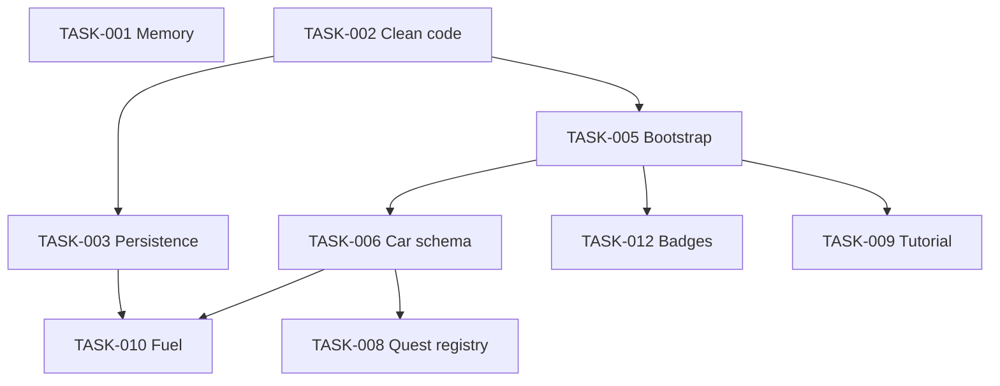

# План spec_cars_web — рефакторинг и фичи wave 1

> **Статус плана:** `Approved` (согласовано пользователем 5 авг. 2026)  
> **Дата:** 5 августа 2026  
> **Источники:** `draft.md`, `PROJECT_PRINCIPLES.md`, анализ `src/`

---

## Цель

1. Рефакторинг под чистый код и устранение утечек памяти.
2. **Расширяемая архитектура контента** — новые карты, скины, автомобили, объекты добавляются через реестры без правок ядра.
3. **Реализовать сейчас:** сохранение топлива, контекстный туториал, система иконок помощи с весами очков.
4. Сохранить режим **«Свободная езда»** как единственный: прямой вход в игру, полицейская машина, летняя карта — **поведение не ломается**.

---

## Решения пользователя (зафиксировано)

| # | Вопрос | Решение |
|---|--------|---------|
| 1 | Порядок экранов | **Перспектива:** выбор машины → выбор режима. **Сейчас:** сразу полицейский автомобиль, прямой старт игры (без меню) |
| 2 | Расширяемость | Реестры и схемы данных для карт, скинов, машин, объектов — **приоритет wave 0** |
| 3 | Счёт помощи | **Сессионный** (обнуляется при каждом заходе в режим). Разделить на **иконки с весами**. **Реализовать сейчас** |
| 4 | Туториал | Контекстный: простой >5 с → зажигание → 2 передача → газ; enemy на дороге → сирена → 4 передача. **Реализовать сейчас** |
| 5 | Режим | Только **свободная езда**; регрессий после рефакторинга быть не должно |
| 6 | Зимняя карта | **Не делать** на этом этапе |
| 7 | Приоритет фич | **Топливо — сейчас. Туториал — сейчас. Меню — не делать** |

---

## Scope текущего релиза

### В scope

| Направление | Детали |
|-------------|--------|
| Clean code | Минимальный diff, дедупликация, мёртвый код |
| Memory leaks | `CarStore.dispose()`, rAF/teardown в модалках |
| Extensibility | Реестры `cars`, `maps`, `objects`, `quests`; bootstrap без `[0]` |
| Fuel persistence (идея 13) | `localStorage`, throttle, per-car key |
| Contextual tutorial | Idle 5 с + события enemy (см. § Туториал) |
| Help badges (идея 1/8) | 3 иконки + веса очков + звёзды |
| Car schema (идея 18 prep) | `service`, `id`, `getDefaultCar()` — без UI выбора |
| Quest registry (идея 18 prep) | `questsByService` — hook для будущих служб |

### Вне scope (отложено)

- Экран меню / выбора режима (идея 14)
- App routing `screen: menu | game` (TASK-004)
- Зимняя карта и unlock (идея 12)
- Режимы «На время», «Ориентировка» (идеи 16–17)
- UI выбора службы, пожарная/МЧС
- Persistence `countHelp` / badges между сессиями
- Ассет `road_winter.png`

---

## Целевой flow (перспектива vs сейчас)

```
Перспектива:  [Выбор машины] → [Выбор режима] → [Игра]
Сейчас:       [Игра: полиция, лето, free]  ← App.jsx → Game.jsx напрямую
```

Архитектура wave 0 закладывает props `carId`, `mapId`, `gameMode` в `Game.jsx` с **дефолтами** (полиция, лето, `free`), чтобы позже подключить экраны без переписывания ядра.

---

## Система помощи — иконки и очки (реализовать сейчас)

### Правила

- Счётчики **сессионные** — обнуляются при каждом входе в режим (монтирование `Game`).
- Вместо одного `countHelp` — **4 типа** (4-й — задел под ориентировку, пока не начисляется):

| Тип | Квест | Иконка (смысл) | Очков за действие | Приоритет отображения |
|-----|-------|------------------|-------------------|----------------------|
| `enemyChase` | Блокировка enemy (`QuestArrestModal`) | Догнали нарушителя | **+4** | 1 (сложнее всего, высший балл) |
| `criminalArrest` | Арест `human_aggr*` (`PoliceQuestModal`) | Преступник пойман | **+3** | 2 |
| `pedestrianFine` | Штраф на переходе (`PedestrianCrossingModal`) | Штраф пешеходу | **+1** | 3 |
| `orientationMatch` | Ориентировка (будущее) | Нашли по тени | **+1** | 4 (не активен) |

### Ребаланс звёзд

- **Сессионный итог:** `sessionScore = enemy×4 + criminal×3 + pedestrian×1` (+ orientation×1 в будущем).
- Enemy сейчас **не учитывается отдельно** в HUD — внедрить иконку `enemyChase` и начисление в `QuestArrestModal` (сейчас там тоже `countHelp += 1`).
- **Звёзды** (вместо голого счётчика): пороги по `sessionScore`, например:
  - ⭐ 1 звезда: ≥ 4 очков (1 enemy или 2 преступника)
  - ⭐⭐ 2 звезды: ≥ 8 очков
  - ⭐⭐⭐ 3 звезды: ≥ 14 очков
  - *(точные пороги — в SPEC после UI/UX; принцип: enemy — максимальный вклад в очки)*

### HUD (`Car.jsx`)

- Убрать или заменить строку `Счётчик помощи: {countHelp}`.
- Показать **3 активные иконки** с счётчиком каждой (число арестов/штрафов/погонь).
- Опционально: суммарные звёзды сессии рядом с иконками.
- `data-type` на иконках: `help-badge-criminal`, `help-badge-pedestrian`, `help-badge-enemy`.

### Изменяемые файлы (evidence)

| Файл | Сейчас |
|------|--------|
| `carStore.jsx:13` | `countHelp = 0` |
| `PoliceQuestModal.jsx:24,37` | `countHelp += 1` |
| `PedestrianCrossingModal.jsx:22,39` | `countHelp += 1` |
| `QuestArrestModal.jsx:29` | `countHelp += 1` |
| `Car.jsx:226` | отображение `countHelp` |

### API стора (целевой)

```javascript
// carStore.jsx — заменить countHelp на:
helpCounts = { criminalArrest: 0, pedestrianFine: 0, enemyChase: 0, orientationMatch: 0 }
sessionScore // computed: weighted sum
addHelp(type) // type: 'criminalArrest' | 'pedestrianFine' | 'enemyChase' | 'orientationMatch'
resetSessionHelp() // при входе в режим
```

---

## Контекстный туториал (реализовать сейчас)

### Триггеры (не one-shot localStorage)

Туториал **контекстный**, привязан к состоянию игры в сессии. Повторяется при каждом новом заходе в режим, пока шаги не пройдены.

#### Блок A — старт (простой >5 с)

Условие «простой»: `currentSpeed === 0` (или близко к 0) **и** машина не движется N секунд с момента монтирования `Game`.

| Шаг | Условие показа | Цель подсветки | Успех (следующий шаг) |
|-----|----------------|----------------|------------------------|
| A1 | Простой ≥ **5 с** | `[data-type="ignition"]` | `isIgnitionOn === true` |
| A2 | После A1 | `[data-type="gear-2"]` | `gear === '2'` |
| A3 | После A2 | `[data-type="gas-pedal"]` | `isGasPressed` или `currentSpeed > 0` |

#### Блок B — enemy (событие на дороге)

| Шаг | Условие показа | Цель | Успех |
|-----|----------------|------|-------|
| B1 | В viewport появился quest-car с `enemy: true` (первый за сессию) | Сирена (кнопка в `Controllers.jsx`) | `sirena === true` |
| B2 | После B1 | `[data-type="gear-4"]` | `gear === '4'` |

**Правила:**
- Блок B может начаться **параллельно** с блоком A (если enemy появился раньше, чем игрок доехал) — приоритет: не перекрывать активную подсказку блока A, enemy-подсказка в очереди.
- Подсветка: CSS pulse `.tutorial-pulse`, z-index **15** (выше controllers 10, ниже HUD 100).
- Overlay `pointer-events: none` — не блокировать тапы.
- При активной квест-модалке (z-index 1000+) — **скрыть** подсказки.
- `prefers-reduced-motion` → статичное кольцо без анимации.
- `data-type`: `tutorial-overlay`, `tutorial-highlight-ignition`, `tutorial-highlight-gear-2`, `tutorial-highlight-gas`, `tutorial-highlight-siren`, `tutorial-highlight-gear-4`.

### Состояние

- `tutorialStore` или поля в `Game`/отдельном observable: `completedSteps: Set`, `idleTimer`, `enemySeenThisSession`.
- **Без** `localStorage` для туториала — только сессия.
- Сброс при unmount `Game` (новый заход в режим).

---

## Расширяемая архитектура контента (wave 0)

### Принцип

Новый контент = **запись в реестре** + (опционально) ассет. Ядро (`Game`, `MapStore`, `CarStore`) не меняется.

| Сущность | Реестр | API |
|----------|--------|-----|
| Автомобили | `cars.jsx` | `id`, `service`, `urlBody`, `urlShell`, `getCarById`, `getDefaultCar`, `getCarsByService` |
| Карты | `maps.jsx` | `id`, `url`, `isDefault`, `getMapById`, `getDefaultMap` |
| Объекты | `objects.jsx` + `subobject.jsx` | `objectConfigs[]`, фабрика для однотипных (human_aggr) |
| Квесты | `quests.jsx` (новый) | `questsByService`, `getQuestsForService`, связь type → helpType |
| Скины | поля в car config | `skins?: { id, urlBody, urlShell }[]` — задел, без UI |

### Bootstrap `Game.jsx`

```javascript
// Дефолты = текущее поведение
const carConfig = getCarById(carId) ?? getDefaultCar();   // полиция
const mapConfig = getMapById(mapId) ?? getDefaultMap();   // лето
const gameMode = props.gameMode ?? 'free';
```

### Спавн объектов

- `nextSpawnDistances` инициализировать из `objectConfigs` в конструкторе `MapStore` — не дублировать вручную 25+ ключей.

---

## Fuel persistence (идея 13 — сейчас)

- Модуль `src/state/persistence.js`: `getFuel(carId)`, `setFuel(value, carId)`, throttle 1–2 с, `beforeunload`.
- Ключ: `spec_cars_fuel_{carId}` (после TASK-006); fallback `spec_cars_fuel`.
- Валидация `[0, maxFuel]`; первый визит — полный бак.
- **Не сохранять:** help counts, позицию, мир.

---

## Ограничения

- MobX-контракт, game loop, z-index — без регрессий.
- `base: /spec_cars_web/` — не менять.
- E2E: прямой вход в игру, существующие `data-type` на контроллерах сохранить.
- Адаптивность: HUD иконок и tutorial pulse — ПК + мобильный.
- Аудитория 3+: иконки без обязательного чтения текста.

---

## Технический долг (кратко)

См. предыдущий аудит. **P0 для wave 0:** `CarStore.dispose()`, `PedestrianCrossingModal` rAF teardown, rAF race flag в `Game.jsx`.

---

## Декомпозиция задач

### Wave 0 — Foundation

| ID | Задача | Контекст | Зависимости |
|----|--------|----------|-------------|
| **TASK-001** | Lifecycle cleanup, утечки памяти | `logic` | — |
| **TASK-002** | Clean code pass | `logic` | — |
| **TASK-003** | Модуль persistence (fuel) | `logic` | TASK-002 |
| **TASK-005** | Game bootstrap: реестры, props, без `[0]` | `logic` | TASK-002 |
| **TASK-006** | Car schema + extensibility | `logic` | TASK-005 |
| **TASK-008** | Quest registry + object factory | `logic` | TASK-006 |

### Wave 1 — Фичи (сейчас)

| ID | Задача | Контекст | Зависимости |
|----|--------|----------|-------------|
| **TASK-010** | Fuel persistence integration | `logic` | TASK-003, TASK-006 |
| **TASK-012** | Help badges, веса очков, звёзды | `mixed` | TASK-005 |
| **TASK-009** | Контекстный туториал (idle + enemy) | `mixed` | TASK-005 |

### Отложено

| ID | Задача | Причина |
|----|--------|---------|
| TASK-004 | App screen routing | Меню не делаем |
| TASK-007 | Map unlock / winter | Пользователь: не заморачиваться |
| TASK-011 | Mode selection screen | Меню не делаем |

---

## Порядок активации

```
TASK-001 → TASK-002 → TASK-003 ─┐
TASK-002 → TASK-005 → TASK-006 → TASK-008
                                 ├→ TASK-010 (fuel)
TASK-005 ────────────────────────┼→ TASK-012 (badges)
                                 └→ TASK-009 (tutorial)
```

**Рекомендуемая последовательность:**  
001 → 002 → 003 → 005 → 006 → 008 → **010** → **012** → **009**

*(Туториал после badges — меньше конфликтов в HUD; fuel можно параллельно с 008)*

---

## Граф зависимостей



---

## Definition of Done — релиз wave 0+1

- [ ] Playwright E2E зелёные (свободная езда, квесты)
- [ ] Vitest зелёные (persistence, help counts, car/map getters)
- [ ] Fuel сохраняется после reload
- [ ] 3 иконки помощи в HUD, enemy учитывается отдельно
- [ ] Очки: enemy +4, преступник +3, штраф +1; звёзды по sessionScore
- [ ] Туториал: idle 5 с → ignition → gear-2 → gas; enemy → siren → gear-4
- [ ] Прямой вход в игру без меню — поведение как до рефакторинга
- [ ] Новая машина/объект добавляется через реестр без правок `Game.jsx` loop

---

## Pipeline

```
PLAN.md (Approved)
  → TASKS.md
  → [UI/UX] для TASK-009, TASK-012
  → Architect → SPEC.md (одна активная задача)
  → Developer → Reviewer
  → [UI/UX приёмка] для mixed
  → PROJECT_DOCS.md → DONE.md
```

**Первая активная задача:** TASK-018 (UI wave)

---

## UI wave (из UI_UX_DRAFT.md)

> Источник: `.cursor/planner/UI_UX_DRAFT.md` (аудит 5 авг. 2026).  
> Порядок: **018 → 016 → 017 → 019 → 021 → 020 → 022**

| ID | Задача | Контекст | Зависимости |
|----|--------|----------|-------------|
| TASK-018 | Цветовая система состояний (CSS variables) | `ui-ux` | — |
| TASK-016 | HUD glass-карточка + убрать дубль скорости + вынести inline CSS | `ui-ux` | TASK-018 |
| TASK-017 | Консолидация control.css / gearbox.css | `ui-ux` | TASK-016 |
| TASK-019 | Канистра топлива — заметнее | `ui-ux` | TASK-016 |
| TASK-021 | Help badges — иконки вместо emoji | `mixed` | TASK-016 |
| TASK-020 | Микроанимации UI + prefers-reduced-motion | `ui-ux` | TASK-017 |
| TASK-022 | Ассет пальца туториала (transparent PNG) | `assets` | TASK-020 |

### Чеклист приёмки UI wave

- [x] HUD читается на ярком фоне травы/дороги
- [x] Скорость понятна за 1 секунду (один primary индикатор)
- [x] HUD и controls визуально из одной «семьи» (glass / radius / palette)
- [x] Touch targets ≥ 48 px на mobile landscape
- [x] Нет inline `<style>` в компонентах HUD
- [x] `prefers-reduced-motion` учтён для анимаций

---

_Обновлено Orchestrator по UI_UX_DRAFT (5 авг. 2026)._
