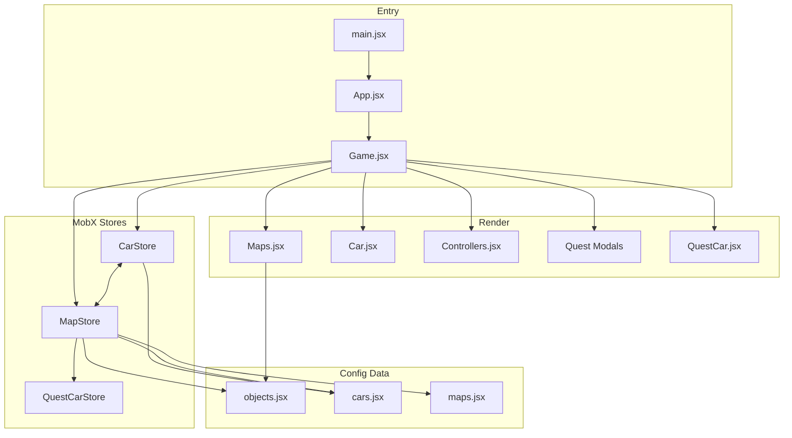

# Принципы работы проекта spec_cars_web

> **Источник правды для всех агентов.** Читать перед любой задачей с изменением кода.
> Дополняет `.cursor/rules/workflow.mdc`, `safe-changes.mdc`, `documentation-sources.mdc`.
> Конкретные изменения по завершённым задачам — в `.cursor/planner/PROJECT_DOCS.md`.

---

## 1. Что это за проект

**spec_cars_web** — браузерная 2D-симуляция вождения полицейского автомобиля с квестами, светофорами, заправками и AI-трафиком.

| Параметр | Значение |
|---|---|
| Название npm-пакета | `spec_cars` |
| Стек | React 19.2, MobX 6, Vite 8, JavaScript (JSX) |
| Деплой | GitHub Pages → `https://ilya6300.github.io/spec_cars_web` |
| Base path | `/spec_cars_web/` (задаётся в `vite.config.js`) |
| Тип приложения | SPA, полноэкранный игровой viewport (`100dvh`) |

---

## 2. Структура проекта

```
spec_cars_web/
├── src/
│   ├── main.jsx              # Точка входа, подключение CSS
│   ├── App.jsx               # Обёртка: fullscreen viewport + <Game />
│   ├── components/
│   │   ├── game/             # Game.jsx, квест-модалки, QuestCar, UI
│   │   ├── car/              # Car, CarModel, Bensin (топливо)
│   │   ├── map/              # Maps — рендер дороги и объектов
│   │   └── controllers/      # Зажигание, КПП, газ, сирена
│   ├── state/                # MobX-сторы и конфигурация данных
│   │   ├── carStore.jsx      # Физика, топливо, передачи, аудио
│   │   ├── mapStore.jsx      # Мир, спавн, квесты, светофор
│   │   ├── questCarStore.jsx # AI-машины на дороге
│   │   ├── objects.jsx       # Конфиги объектов окружения
│   │   ├── subobject.jsx     # Деревья и пешеходы (human1–16)
│   │   ├── cars.jsx          # Данные машин (полиция + otherCars)
│   │   ├── maps.jsx          # Данные карт (фон дороги)
│   │   └── state_app.jsx     # Глобальные константы (distanceMetersFactor)
│   ├── style/                # CSS по подсистемам
│   └── assets/               # Спрайты, аудио, карты (импортируются через Vite)
│       ├── background/       # Полноэкранные фоны меню и атмосферы (день/ночь)
│       ├── maps/             # Тайлинг фона дороги (repeat-x в Maps.jsx)
│       ├── objects/          # Спрайты объектов окружения
│       ├── effects/          # Overlay-текстуры (дождь SVG)
│       ├── ui/               # HUD, меню, иконки режимов
│       └── audio/            # Звуковые эффекты
├── tests/e2e/                # Playwright E2E
├── src/**/*.test.{js,jsx}    # Vitest unit/integration
├── cypress/e2e/              # Cypress (legacy, дублирует часть сценариев)
├── public/                   # manifest.json, icons.svg
├── vite.config.js            # base: /spec_cars_web/
├── playwright.config.js      # baseURL с учётом base path
└── .cursor/planner/          # Планирование агентов (TASKS, SPEC, PLAN…)
```

### Ключевые файлы по подсистемам

| Подсистема | Файлы |
|---|---|
| Игровой цикл | `src/components/game/Game.jsx` |
| Физика машины | `src/state/carStore.jsx` |
| Мир и спавн | `src/state/mapStore.jsx`, `src/state/objects.jsx` |
| Рендер карты | `src/components/map/Maps.jsx` |
| Управление | `src/components/controllers/Controllers.jsx`, `GearBox.jsx` |
| Квест: полиция (human_aggr*) | `PoliceQuestModal.jsx`, `objects.jsx` |
| Квест: пешеходный переход | `PedestrianCrossingModal.jsx`, `carStore.checkTrafficLight` |
| Квест: блокировка машины | `QuestArrestModal.jsx`, `QuestCar.jsx`, `mapStore.checkQuestCarDistance` |
| AI-трафик | `questCarStore.jsx`, `mapStore.spawnQuestCar` |
| Данные машин | `src/state/cars.jsx` |
| Фоны меню / атмосферы | `src/assets/background/` — полноэкранные PNG (день/ночь), не путать с `src/assets/maps/` (тайл дороги) |

---

## 3. Архитектура приложения

### 3.1. Точка входа и bootstrap

```
index.html → main.jsx → App.jsx → Game.jsx
```

1. `main.jsx` монтирует React в `#root`, подключает глобальные CSS.
2. `App.jsx` создаёт fullscreen-контейнер без скролла.
3. `Game.jsx` — центральный компонент: создаёт сторы, запускает game loop, рендерит все слои.

**Порядок инициализации в `Game.jsx`:**

```javascript
const [activeCarStore] = useState(() => new CarStore(Cars.cars[0]));
const [activeMapStore] = useState(() => {
  const store = new MapStore(MapsStore.maps[0]);
  store.carStore = activeCarStore;
  return store;
});
activeCarStore.mapStore = activeMapStore; // двусторонняя связь
```

Сторы создаются **один раз** через `useState(() => …)` и живут всё время сессии.

### 3.2. MobX — обязательный контракт

| Правило | Как соблюдать |
|---|---|
| Реактивность UI | Компоненты, читающие observable, оборачивать в `observer` из `mobx-react-lite` (импорт `mobx-lite`) |
| Мутации | Только через методы класса-стора; внутри — `runInAction(() => { … })` где нужно |
| Запрет | Прямая мутация observable из JSX или из чужого стора без action |
| Создание сторов | `makeAutoObservable(this)` в конструкторе |
| Таймеры | Очищать в `dispose()` / cleanup `useEffect` (`cancelAnimationFrame`, `clearInterval`) |

**Связь сторов:**

- `CarStore.mapStore` — для физики (торможение при аресте, светофор).
- `MapStore.carStore` — для заправки, скорости полиции в AI-трафике.

### 3.3. Игровой цикл (game loop)

Единственный цикл — `requestAnimationFrame` в `Game.jsx`:

```
каждый кадр:
  deltaTime = (now - lastTime) / 1000   // секунды, НЕ кадры
  carStore.updatePhysics(deltaTime)
  distance += carStore.currentSpeed * deltaTime
  mapStore.update(speed, deltaTime)     // offsetX += speed * deltaTime
  carStore.checkTrafficLight(mapStore)
  mapStore.spawnObjects(viewportWidth, deltaTime)
  mapStore.despawnObjects(viewportWidth)
  mapStore.triggerAppearEvents(carStore)
  mapStore.updateQuestCars(deltaTime)
  mapStore.checkQuestCarDistance(...)
```

**Критично:** все движения привязаны к `deltaTime`, а не к частоте кадров. Новый код с анимацией/движением **обязан** использовать `deltaTime`.

### 3.4. Система координат

Два пространства:

| Пространство | Описание | Пример |
|---|---|---|
| **Мировые координаты** | `obj.worldX` — позиция объекта на «бесконечной» дороге | `worldX = offsetX + viewportWidth + random` |
| **Экранные координаты** | `screenX = worldX - offsetX` (≈ `worldX - distance`) | `left: ${screenX}px` |

- Полицейская машина **фиксирована** на экране (`left: 30px` в CSS).
- Мир «едет» влево через накопление `offsetX` / `distance`.
- Фон дороги: `background-repeat: repeat-x`, смещение разметки через `backgroundPositionX: -${distance}px`.
- Quest-машины используют **экранные** координаты (`positionX`), не мировые.

### 3.5. Спавн объектов окружения

Конфигурация — массив `objectConfigs` в `objects.jsx` + `subobject.jsx`:

```javascript
{
  type: "building" | "gas_station" | "traffic_light" | "tree1" | "human1" | "human_aggr1" | …
  width, height, zIndex
  minDistance, maxDistance   // интервал спавна в world px (÷20 = игровые м; см. GAME_UNITS.md)
  onClick, onLongPress, onAppear  // колбэки
}
```

**Алгоритм (`mapStore.spawnObjects`):**

1. Для каждого типа проверяется `offsetX >= nextSpawnDistances[type]`.
2. Новый объект: `worldX = max(offsetX + viewportWidth, lastObjectEndMeter) + random(0..100)`.
3. `lastObjectEndMeter` предотвращает наложение объектов.
4. Следующий спавн: `nextSpawn += minDistance + random * (maxDistance - minDistance)`.

**Despawn:** объект удаляется, когда `screenX <= -width`.

### 3.6. Послойный рендеринг (Z-Index)

Строгая иерархия слоёв (снизу вверх). Stacking context — `.game-viewport`.  
`.car-ui` **не** имеет `z-index` (нет stacking context). Не вешать на `.car-ui` `transform` / `filter` / `opacity < 1` / `isolation`.

```
z-index 1     — .game-map (фон дороги; ночной filter только здесь)
z-index 0     — .road-wet (внутри .game-map; видим только night+rain)
z-index 2     — .road-line (разметка), объекты zIndex: 2 (светофор, заправка, human_aggr)
z-index 1     — объекты zIndex: 1 (дома, деревья, пешеходы)
z-index 45    — AtmosphereOverlay (ночь)
z-index 50    — .quest-car-other (AI-машины)
z-index 55    — collectible-star / pedestrian layer (только free)
z-index 60    — спрайт игрока (.car_container--player.car_container--standalone)
z-index 100   — .game-rain-container (капли; только night+rain)
z-index 105   — .hud-panel, .speed-display
z-index 110   — .controllers_container
z-index 120   — .mode-hud
z-index 130   — .game-global-stars
z-index 140   — .star-fly-overlay (только free)
z-index 300   — BackToMenuButton
z-index 1000+ — квест-модалки / arrest / finish / refuel / mode-result
```

Дождь и мокрый асфальт — `pointer-events: none`. Капли поверх машин, под HUD. Детали chase-атмосферы — `PROJECT_DOCS.md` TASK-049.

**Правило для агентов:** новые визуальные элементы вставлять в правильный слой. UI и модалки не должны перекрывать управление некорректно; игровые объекты не должны быть поверх HUD без явного требования.

---

## 4. Игровые подсистемы

### 4.1. Управление автомобилем (CarStore)

| Элемент | Метод / свойство | Поведение |
|---|---|---|
| Зажигание | `toggleIgnition()` | Web Audio API: стартер → мотор (loop) через 1 с |
| Газ | `pressGas()` / `releaseGas()` | Разгон при `isIgnitionOn && fuel > 0` |
| КПП | `shiftGear('N'|'1'|'2'|'3'|'4')` | `gearRatio` ограничивает maxSpeed; блокировки при высокой скорости |
| Топливо | `fuel`, `refuel()`, расход в `updatePhysics` | При `fuel <= 0` — газ отключается |
| Сирена | `toggleSirena()` | Loop-звук; влияет на квесты и торможение |
| Физика | `updatePhysics(deltaTime)` | acceleration, friction, wheelRotation, distanceMeters |

**Конвертация скорости для UI:** `displaySpeed = currentSpeed * Cars.speedMultiplierUI` (≈ 0.156).

**Остановка на красном:** `updatePhysics` вызывает `forceStop()` при `trafficLightColor === 'red'`.

### 4.2. Светофор

- Глобальный таймер в `MapStore.startTrafficLightTimer()` — переключение red/green каждые **10 секунд**.
- Изображение выбирается в `Maps.jsx` по `map.trafficLightColor`.
- `carStore.checkTrafficLight(mapStore)` — определяет видимость светофора (дистанция 300–700 px от offsetX).
- `mapStore.trafficLightOnTheMap` — флаг видимости на экране (для despawn-логики).

### 4.3. Заправка

- **Клик** по `gas_station` → `refuelCar(10)`.
- **Long press** (500 ms) → `startRefueling()` (interval +200 каждые 100 ms).
- **Pointer up/leave** → `stopRefueling()`.

### 4.4. Квесты

#### A. Police Quest (human_aggr1/2/3)

- **Триггер:** клик по объекту `human_aggr*` на карте.
- **Действия:** `mapStore.startQuest(obj)`, `carStore.toggleSirena()`.
- **UI:** `PoliceQuestModal` — анимация полицейской машины, кнопка «Задержать».
- **Завершение:** `mapStore.finishQuest()`, `countHelp++`, сирена off.

#### B. Pedestrian Crossing Quest

- **Триггер:** остановка на красном светофоре, 30% шанс (один раз за цикл красного).
- **Условия:** сирена off, нет других активных квестов.
- **Старт:** `mapStore.startPedestrianCrossingQuest(targetObj)`.
- **UI:** `PedestrianCrossingModal`.

#### C. Quest Cars (AI-трафик)

- **Спавн:** каждые 10–30 с (`questCarSpawnTimer`), из `Cars.otherCars`.
- **Enemy (`enemy: true`):** появляются слева (`positionX = -200`), обгоняют полицейского.
- **Civilian:** появляются справа (`viewportWidth + 200`).
- **Движение:** `positionX += (questCarSpeed - policeSpeed) * deltaTime`.
- **Арест:** `checkQuestCarDistance` — enemy в зоне `[30, 280]` px → `questCarForArrest`.
- **Кнопка «Блокировать»:** в `Game.jsx`, запускает `startQuestArrest()`.

#### D. Quest Arrest Modal

- Полноэкранная модалка (`z-index: 1200+`).
- `mapStore.isQuestArrestActive`, `arrestAnimFinished`.

### 4.5. Взаимоисключение квестов

Перед запуском нового квеста проверять флаги:

```javascript
!mapStore.isPedestrianCrossingQuestActive
!mapStore.isPoliceQuestActive
!mapStore.isQuestArrestActive
```

Кнопка ареста скрыта, если активен любой из квестов-модалок.

### 4.6. Аудио

- Web Audio API (`AudioContext`), инициализация по user gesture (зажигание/сирена).
- `audioCtx.resume()` при `state === 'suspended'`.
- При выключении зажигания/сирены — `stop()`, `disconnect()`, очистка source.
- **Не** использовать `<audio>` HTML для игровых звуков.

---

## 5. UI и data-атрибуты для тестов

E2E-тесты (Playwright) опираются на `data-type`:

| data-type | Элемент |
|---|---|
| `ignition` | Ключ зажигания |
| `gas-pedal` | Педаль газа |
| `gear-N`, `gear-1` … `gear-4` | Кнопки КПП |
| `car` | UI полицейской машины |
| `quest-car` | AI-машина (`data-enemy="true/false"`) |
| `arrest-button` | Кнопка «Блокировать» |

**Playwright hook:** при `window.__PLAYWRIGHT__ = true` Game экспортирует:

```javascript
window.__TEST_STATE__ = { activeMapStore, activeCarStore, distance };
```

Новые интерактивные элементы **должны** иметь `data-type` для E2E.

---

## 6. Сборка, запуск, деплой

### Локальная разработка

```bash
npm install
npm run dev          # http://localhost:5173/spec_cars_web/
npm run build        # dist/ с base /spec_cars_web/
npm run preview      # preview production build
```

### Тесты

```bash
npm test                              # Vitest (src/**/*.test.{js,jsx})
npm run test:playwright               # Playwright E2E (поднимает dev server)
npm run test:e2e:cypress              # Cypress (legacy)
```

Playwright `baseURL`: `http://localhost:5173/spec_cars_web/` — **учитывать base path** при навигации.

### Деплой

- GitHub Actions (`.github/workflows/deploy.yml`): push в `main` → build → GitHub Pages.
- `vite.config.js`: `base: "/spec_cars_web/"` — **не менять** без согласования (сломает assets на Pages).

---

## 7. Правила разработки для агентов

### 7.0. Работа на основе данных (обязательно)

Полный регламент: **`.cursor/rules/evidence-based-work.mdc`**.

Кратко:

1. **Анализ → gate → код.** Правки только после чтения файлов, grep и таблицы влияния.
2. **Баги:** симптом → локализация в коде → цепочка вызовов → правка. Без локализации — `Needs Clarification`.
3. **Каждое утверждение** о поведении игры — со ссылкой на файл/строку или SPEC.
4. **Reviewer** отклоняет замечания Developer без доказательств и diff вне SPEC.

### 7.1. Обязательно перед кодом

1. Прочитать **этот файл** (`PROJECT_PRINCIPLES.md`).
2. Прочитать **активную задачу** в `.cursor/planner/TASKS.md` и `.cursor/planner/SPEC.md`.
3. Прочитать **затронутые файлы** целиком (не только строку правки).
4. **Grep** по ключевым символам — все вызовы и зависимости.
5. Заполнить **таблицу влияния** (`evidence-based-work.mdc` §4).
6. Пройти **gate** «можно писать код».

### 7.2. Стиль кода

- JavaScript + JSX, **без TypeScript**.
- Стрелочные функции, camelCase, optional chaining `?.`.
- Импорты ассетов через Vite (`import img from "../assets/..."`) — **статические import допустимы** (это Vite SPA, не CDN embed).
- CSS — отдельные файлы в `src/style/` или co-located (`.css` рядом с компонентом).
- Не оставлять `console.log` (допустим только `console.error` в catch).

### 7.3. MobX — типичные ошибки

| Ошибка | Правильно |
|---|---|
| Мутировать `offsetX` из `Maps.jsx` | Через `mapStore.update()` |
| Забыть `observer` на компоненте со store | Обернуть в `observer()` |
| Создавать стор в render без `useState` | `useState(() => new Store())` |
| Не чистить rAF/setInterval | cleanup в `useEffect` return / `dispose()` |
| Прямой push в observable без action | Метод стора + `runInAction` |

### 7.4. Минимальный diff

- Менять **только** то, что требует задача (см. `safe-changes.mdc`).
- Не рефакторить соседний код «заодно».
- Не удалять код без проверки зависимостей (grep по проекту).
- Не добавлять npm-пакеты без указания в `SPEC.md`.

### 7.5. Тестовый код

| Тип | Где |
|---|---|
| Unit/integration | `src/**/*.test.{js,jsx}` (Vitest + Testing Library) |
| E2E | `tests/e2e/*.spec.js` (Playwright) |
| Legacy E2E | `cypress/e2e/*.cy.js` |
| Моки для E2E | `window.__PLAYWRIGHT__`, `window.__TEST_STATE__` |

Production-модули **не** содержат тестовых заглушек и фейковых данных.

---

## 8. Code Review — чек-лист (Reviewer / QA)

### 8.1. Геометрия и рендеринг

- [ ] Z-index соответствует иерархии слоёв (§3.6).
- [ ] Координаты: `screenX = worldX - offsetX`; движение через `deltaTime`.
- [ ] Бесшовный loop фона/разметки не сломан.
- [ ] Новые объекты не накладываются (`lastObjectEndMeter`).

### 8.2. MobX и game loop

- [ ] `observer` на компонентах, читающих store.
- [ ] Нет прямых мутаций observable из UI.
- [ ] `requestAnimationFrame` / `setInterval` очищаются при unmount.
- [ ] Физика не привязана к FPS.

### 8.3. Квесты и логика

- [ ] Взаимоисключение квестов сохранено.
- [ ] Новые триггеры не ломают существующие (`checkTrafficLight`, `onAppear`, `onClick`).
- [ ] Сирена/светофор/передачи — побочные эффекты учтены.

### 8.4. Чистота

- [ ] Нет `console.log`, закомментированного мёртвого кода.
- [ ] Нет неиспользуемых импортов.
- [ ] `data-type` добавлен для новых интерактивных элементов.

### 8.5. Тесты и деплой

- [ ] Vitest/Playwright проходят (или добавлены тесты для нового поведения).
- [ ] `base: "/spec_cars_web/"` не сломан.
- [ ] Новые ассеты лежат в `src/assets/`.

---

## 9. Workflow агентов

```
Пользователь (PLAN.md)
  → Planner — TASKS.md [Контекст: logic | ui-ux | assets | mixed]
  → [UI/UX Designer]           ← ui-ux | mixed
  → Architect — SPEC.md
  → [Game Art Director]        ← assets | mixed
  → Developer — production-код
  → Reviewer — code review
  → [UI/UX приёмка]            ← ui-ux | mixed
  → [Art приёмка]              ← assets | mixed
  → Technical Documentation Writer — PROJECT_DOCS.md
  → Orchestrator — DONE.md
```

**Game Design Director** — только идеи в `GAME_DESIGN_DRAFT.md`, **вне** TASK-XXX.

| Кто | Может | Не может |
|---|---|---|
| **Orchestrator** | TASKS.md, SPEC.md, DONE.md, GAME_DESIGN_DRAFT.md, статусы | Писать код |
| **Planner** | Декомпозиция, Контекст, поле «Документация» | Писать код, менять статусы |
| **UI/UX Designer** | UI/UX требования, визуальная приёмка | Код, статусы |
| **Game Art Director** | Промпты, art spec, приёмка ассетов | Код, статусы |
| **Game Design Director** | Идеи для GAME_DESIGN_DRAFT.md | TASK pipeline, код, статусы |
| **Architect** | SPEC.md, список файлов, риски | Писать код |
| **Developer** | Код в `src/`, тесты | Review, статусы |
| **Reviewer** | Code review, замечания | Писать код, статусы |
| **Tech Doc Writer** | PROJECT_DOCS.md после всех приёмок | Код, статусы |

**Одна активная задача** — `SPEC.md` перезаписывается при смене задачи.

**Needs Clarification** — если данных недостаточно, агент возвращает отчёт Orchestrator, **не додумывает**.

**Циклы Developer → Reviewer:** max 5; на 3-м — анализ Architect; на 5-м — BLOCKED.

---

## 10. Карта зависимостей (упрощённо)



---

## 11. Частые сценарии изменений

### Добавить новый объект окружения

1. Спрайт → `src/assets/objects/`.
2. Конфиг в `objects.jsx` или `subobject.jsx` (type, width, height, zIndex, min/maxDistance, callbacks).
3. Добавить `nextSpawnDistances[type]` в `mapStore.jsx`.
4. При необходимости — CSS в `src/style/`.
5. E2E: `data-type` на элементе.

### Добавить новый квест

1. Флаги состояния в `MapStore` (is*Active, targetObject).
2. Методы start/finish в `MapStore`.
3. Триггер (onClick, checkTrafficLight, spawn logic…).
4. Модальный компонент в `src/components/game/`.
5. CSS с z-index ≥ 1000.
6. Проверить взаимоисключение с существующими квестами.
7. Playwright spec в `tests/e2e/`.

### Изменить физику / скорость

1. `carStore.updatePhysics` — acceleration, friction, gearRatio.
2. `Cars.speedMultiplierUI` — отображение км/ч.
3. `state_app.distanceMetersFactor` — пройденная дистанция.
4. Проверить AI-трафик (`questCarStore.updatePosition`).

### Добавить UI-контрол

1. Компонент в `controllers/` или `game/`.
2. CSS в `control.css` / `interface.css`, z-index ≥ 10.
3. Методы в `CarStore` или `MapStore`.
4. `data-type` для E2E.

---

## 12. Ограничения платформы

- **Только браузер.** Нет SSR, нет Node.js runtime в production.
- **Адаптивная разработка (обязательно):** игра на ПК и мобильных с разными экранами. Размеры и позиции UI — относительно viewport (`100dvh`, `vw`/`vh`, `clamp()`, media queries в `src/style/media.css`); game loop и спавн — через `viewportWidth` (`Game.jsx`). Запрещён desktop-only layout без мобильного сценария.
- **Mobile:** viewport `100dvh`, touch-события на педали газа, `user-scalable=no`.
- **Audio:** требует user gesture для первого `AudioContext`.
- **GitHub Pages:** статический hosting, base path обязателен.
- **Нет backend/API.** Все данные локальны (MobX + статические assets).

---

## 13. Связанные документы

| Документ | Назначение |
|---|---|
| `.cursor/planner/PLAN.md` | План пользователя |
| `.cursor/planner/TASKS.md` | Активные задачи |
| `.cursor/planner/SPEC.md` | Спецификация текущей задачи |
| `.cursor/planner/SOURCES.md` | Реестр источников |
| `.cursor/planner/PROJECT_DOCS.md` | История завершённых задач |
| `.cursor/planner/GAME_UNITS.md` | world px ↔ игровые метры (`distanceMetersFactor`) |
| `.cursor/rules/workflow.mdc` | Жизненный цикл агентов |
| `.cursor/rules/safe-changes.mdc` | Минимальный diff |
| `.cursor/agents/orchestrator.md` | Роль Orchestrator |

---

## 14. Глоссарий

| Термин | Значение |
|---|---|
| `offsetX` / `distance` | Смещение мира вправо (сколько «проехали» в **world px**) |
| `distanceMetersFactor` | Делитель world px → игровые метры (20); см. `GAME_UNITS.md` |
| `worldX` | Абсолютная позиция объекта на дороге |
| `screenX` | Позиция объекта на экране |
| `enemy` | AI-машина, которую можно блокировать |
| `countHelp` | Счётчик успешных квестов |
| `gearRatio` | Передаточное число КПП |
| `objectConfigs` | Реестр типов объектов окружения |
| `questCarForArrest` | Ближайшая enemy-машина в зоне ареста |

---

_Документ создан на основе анализа кодовой базы spec_cars_web. При изменении архитектуры — обновлять через Architect → Orchestrator._
