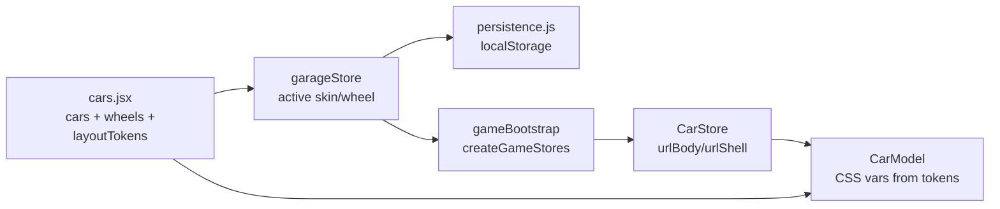
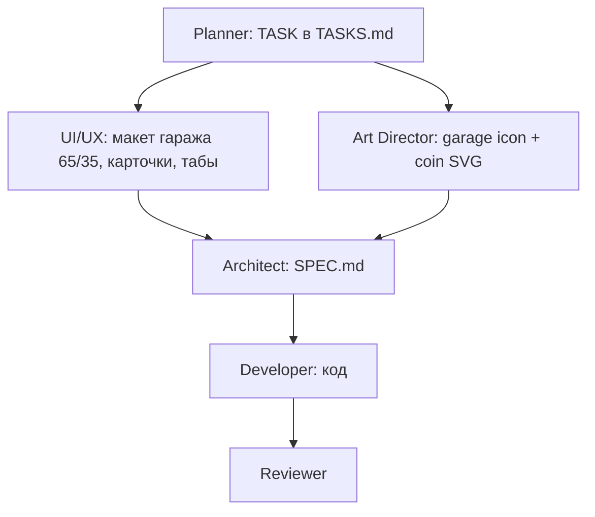

# PLAN.md — Гараж, колёса, монеты

## Контекст

[PLAN.md](c:/Frontend/games/spec_cars_web/.cursor/planner/PLAN.md) описывает **новый план** (не связан с завершённым «Оживление мира»). Активной задачи в [TASKS.md](c:/Frontend/games/spec_cars_web/.cursor/planner/TASKS.md) нет — перед разработкой Orchestrator заводит новую TASK и Architect пишет SPEC.

**Текущее состояние (код):**

- Данные машины: [`src/state/cars.jsx`](c:/Frontend/games/spec_cars_web/src/state/cars.jsx) — одна полицейская машина, `skins: [{ id: "default", ... }]`, колёса = `shell_1.png`.
- Геометрия игрока: CSS-переменные в [`src/style/ui-tokens.css`](c:/Frontend/games/spec_cars_web/src/style/ui-tokens.css) (стр. 51–58), прокидываются через [`src/style/player-car.css`](c:/Frontend/games/spec_cars_web/src/style/player-car.css).
- Рендер: [`CarModel.jsx`](c:/Frontend/games/spec_cars_web/src/components/car/CarModel.jsx) читает `carStore.urlBody` / `urlShell`; игра создаёт стор через [`gameBootstrap.js`](c:/Frontend/games/spec_cars_web/src/state/gameBootstrap.js).
- Валюта: [`starsStore.jsx`](c:/Frontend/games/spec_cars_web/src/state/starsStore.jsx) + `localStorage` ключ `spec_cars_total_stars`; UI — [`GlobalStarsDisplay.jsx`](c:/Frontend/games/spec_cars_web/src/components/ui/GlobalStarsDisplay.jsx), collectible на карте — `collectible_star`.
- Навигация: [`appStore.jsx`](c:/Frontend/games/spec_cars_web/src/state/appStore.jsx) — экраны `menu | game | ui-test`; паттерн «назад» — [`BackToMenuButton.jsx`](c:/Frontend/games/spec_cars_web/src/components/game/BackToMenuButton.jsx).
- 16 колёс уже в [`src/assets/cars/whell/`](c:/Frontend/games/spec_cars_web/src/assets/cars/whell/) (`whell_new_1.png` … `whell_new_16.png`).
- Фон гаража: [`src/assets/background/car_box.png`](c:/Frontend/games/spec_cars_web/src/assets/background/car_box.png).

**Решения пользователя:**

- Миграция звёзд → **полная** (store, типы объектов, persistence, тесты, HUD/результаты).
- Иконки гаража и монет — **сначала Art Director**, затем UI.

**Вне scope сейчас (только заложить в архитектуру):** магазин на дороге, покупка, `open: false`, несколько кузовов.

---

## Архитектура данных



### 1.1 — Токены геометрии в объекте машины

В [`cars.jsx`](c:/Frontend/games/spec_cars_web/src/state/cars.jsx) у `police-0` добавить объект (имя в SPEC, например `layoutTokens`):

| Поле        | Значение (из ui-tokens) |
| ----------- | ----------------------- |
| width       | `250px`                 |
| wheelOffset | `11%`                   |
| bodyLift    | `-1%`                   |
| wheelBottom | `-11%`                  |
| wheelSize   | `20.5%`                 |
| wheelLeft   | `9%`                    |
| wheelRight  | `69%`                   |

**Не переносить** `--player-car-lane-y` — это глобальная позиция полосы, остаётся в `ui-tokens.css` / `media.css`.

**Применение (1.2):** [`CarModel.jsx`](c:/Frontend/games/spec_cars_web/src/components/car/CarModel.jsx) для `variant="player"` принимает `layoutTokens` и выставляет CSS-переменные на контейнере через `style` (мост в [`player-car.css`](c:/Frontend/games/spec_cars_web/src/style/player-car.css) сохраняется). Источник токенов — resolved-конфиг из `garageStore` / `getCarById`.

Дублирующие строки 52–58 удалить из [`ui-tokens.css`](c:/Frontend/games/spec_cars_web/src/style/ui-tokens.css) после подключения runtime-источника; mobile override `--player-car-width: 220px` в [`media.css`](c:/Frontend/games/spec_cars_web/src/style/media.css) — через merge в `garageStore` или отдельный mobile-токен в SPEC.

### 1.3–1.4 — Массив `wheels`

Рядом с `cars` в [`cars.jsx`](c:/Frontend/games/spec_cars_web/src/state/cars.jsx):

```javascript
wheels: [
  {
    id: "shell_1",
    name: "Стандарт",
    src: shell_1,
    active: true,
    open: true,
    price: 5,
  },
  {
    id: "whell_new_1",
    name: "Колёса 1",
    src: whellNew1,
    active: false,
    open: true,
    price: 5,
  },
  // … whell_new_2 … whell_new_16
];
```

**Доп. поля (обоснование для SPEC):**

- `id` — стабильный ключ для persistence (лучше, чем `name`).
- `active` — выбрано сейчас (единственный `true`).
- `open` — разблокировано (сейчас все `true`; в магазине `false` + серый фильтр).
- `price` — цена в магазине (сейчас `5`, в гараже **не показывать**, PLAN §2.4).

### Skins на машине

Расширить `skins[]` и сам объект `cars[0]`:

```javascript
{
  id: "police-0",
  active: true, open: true, price: 0,
  skins: [{ id: "default", urlBody: policeBody, active: true, open: true, price: 0 }],
  // layoutTokens, maxSpeed, …
}
```

`urlShell` на уровне машины/скина **убрать из источника правды** — колёса только из `wheels[]`. `getResolvedPlayerCar()` возвращает `{ ...car, urlBody, urlShell, layoutTokens }`.

### MobX `garageStore` (новый файл)

[`src/state/garageStore.jsx`](c:/Frontend/games/spec_cars_web/src/state/garageStore.jsx):

- `selectSkin(skinId)` / `selectWheel(wheelId)` — мгновенно, без confirm (PLAN §2.5–2.6).
- `getPreviewCarStore()` — lightweight объект для превью в гараже.
- `getResolvedPlayerCar()` — для `createGameStores`.
- Persist: `spec_cars_active_skin`, `spec_cars_active_wheel` (+ опционально snapshot `open` для будущего магазина).
- При `select*`: сброс `active` у предыдущего, установка нового, save.

---

## §2 — Монеты (полная миграция)

| Было                                                    | Станет                                                               |
| ------------------------------------------------------- | -------------------------------------------------------------------- |
| `starsStore` / `totalStars`                             | `coinsStore` / `totalCoins`                                          |
| `addStars`                                              | `addCoins`                                                           |
| `loadTotalStars` / `saveTotalStars`                     | `loadTotalCoins` / `saveTotalCoins`                                  |
| `spec_cars_total_stars`                                 | `spec_cars_total_coins` (+ миграция: прочитать старый ключ один раз) |
| `collectible_star`                                      | `collectible_coin`                                                   |
| `calculateSessionStars`                                 | `calculateSessionCoins`                                              |
| `sessionStars` / `starsEarned`                          | `sessionCoins` / `coinsEarned`                                       |
| `isStarCollectionUnlocked`                              | `isCoinCollectionUnlocked`                                           |
| `GlobalStarsDisplay`                                    | `GlobalCoinsDisplay`                                                 |
| `collectible-star.svg`                                  | `collectible-coin.svg` (Art Director)                                |
| CSS `.global-stars`, `.help-stars`, `.mode-result-star` | `.global-coins`, `.help-coins`, `.mode-result-coin`                  |
| Leaderboard `★ {record.stars}`                          | иконка монеты + `{record.coins}`                                     |
| E2E `[data-type="global-stars"]`                        | `[data-type="global-coins"]`                                         |

**Затронутые файлы (grep-подтверждение):** `mapStore.jsx`, `objects.jsx`, `modeStore.jsx`, `modeScoring.js`, `Game.jsx`, `StarFlyOverlay.jsx` → `CoinFlyOverlay`, `CollectibleStarLayer.jsx`, `HelpBadges.jsx`, `ModeResultModal.jsx`, `recordsStore.jsx`, `persistence.js`, все `*.test.*` и `tests/e2e/*`.

Логика начисления **не меняется** (1 collectible = +1, рейтинг 0–3 за сессию — те же пороги в `modeScoring`).

---

## §2.2–2.6 — Экран «Гараж»

### Навигация

[`appStore.jsx`](c:/Frontend/games/spec_cars_web/src/state/appStore.jsx):

- `screen: "menu" | "garage" | "game" | "ui-test"`
- `openGarage()` / `backFromGarage()` (аналог `backToMenu`, без сброса кастомизации)

[`AppScreen.jsx`](c:/Frontend/games/spec_cars_web/src/components/app/AppScreen.jsx): рендер `<Garage />` при `screen === "garage"`.

### StartMenu

[`StartMenu.jsx`](c:/Frontend/games/spec_cars_web/src/components/menu/StartMenu.jsx): кнопка с иконкой гаража в `start-menu__header-actions` → `appStore.openGarage()`. **Иконка — PNG/SVG от Art Director** (`src/assets/menu/garage.png` или `src/assets/ui/garage.svg`).

### Компонент Garage (новый)

[`src/components/garage/Garage.jsx`](c:/Frontend/games/spec_cars_web/src/components/garage/Garage.jsx) + [`src/style/garage.css`](c:/Frontend/games/spec_cars_web/src/style/garage.css):

| Зона       | Содержимое                                                                        |
| ---------- | --------------------------------------------------------------------------------- |
| Фон        | `car_box.png` full-screen                                                         |
| Левые 65%  | `<CarModel variant="player" nested carStore={preview} layoutTokens={…} />`        |
| Правые 35% | Табы «Автомобили» / «Колёса» + сетка карточек                                     |
| Верх/угол  | `GlobalCoinsDisplay` + кнопка выхода (переиспользовать SVG из `BackToMenuButton`) |

**Карточка (§2.4–2.5):**

- Превью `src` (body для skins / wheel для wheels).
- `open === false` → `filter: grayscale(0.6) brightness(0.75)` + `pointer-events: none` (на будущее; сейчас все open).
- `active === true` → рамка/accent (`--ui-accent`).
- **Без price** в UI.
- `onClick` → `garageStore.select*` (мгновенное применение на превью).

**Вкладка «Автомобili»:** сейчас одна карточка `police-0` + skins (один default). **Вкладка «Колёса»:** 17 элементов (shell_1 + 16 new).

### Связь с игрой (§2.6)

[`gameBootstrap.js`](c:/Frontend/games/spec_cars_web/src/state/gameBootstrap.js): `const carConfig = garageStore.getResolvedPlayerCar()` вместо сырого `getCarById`.

Выход из гаража → меню; старт режима → те же `urlBody`/`urlShell`/tokens.

---

## Зависимости агентов (workflow)



**Gate для UI-кнопки гаража и coin-иконок:** Art Director поставляет ассеты → Developer подключает. Layout/CSS каркас гаража можно делать с текстовыми табами до иконок.

---

## Тесты

| Область                | Файлы                                                                  |
| ---------------------- | ---------------------------------------------------------------------- |
| `garageStore`          | select active, persist, resolved config                                |
| `coinsStore`           | migration from old localStorage key                                    |
| `cars.jsx`             | wheels count 17, layoutTokens present                                  |
| `getResolvedPlayerCar` | merges skin + wheel                                                    |
| E2E menu               | garage open/close, wheel apply persists after game                     |
| E2E                    | `global-coins`, collectible pickup                                     |
| Обновить               | `menu.spec.js`, `game.spec.js`, `debug-star-visibility.spec.js` → coin |

---

## Риски и ограничения

- **Mobile width 220px** — без override превью/игра могут расходиться; SPEC должен описать merge токенов.
- **Переименование collectible** — большой diff в `mapStore`/`objects`/E2E; делать атомарно в одной TASK.
- **Один автомобиль** — вкладка «Автомобили» минимальна; архитектура готова к нескольким `cars[]`.
- **Опечатка `whell`** в пути assets — сохранить как в репозитории, не переименовывать без отдельной задачи.

---

## Предлагаемое разбиение TASK (для Orchestrator)

1. **TASK-GARAGE-DATA** — `cars.jsx` tokens + wheels + `garageStore` + persistence + `gameBootstrap` + CarModel tokens (без UI гаража).
2. **TASK-COINS** — полная миграция stars → coins (можно параллельно с DATA после SPEC).
3. **TASK-GARAGE-UI** — экран гаража + StartMenu кнопка (**blocked on Art** для иконок) + CSS + E2E.

Или одна TASK «Garage + Coins» с чекпоинтами — если предпочитаете один цикл review.
